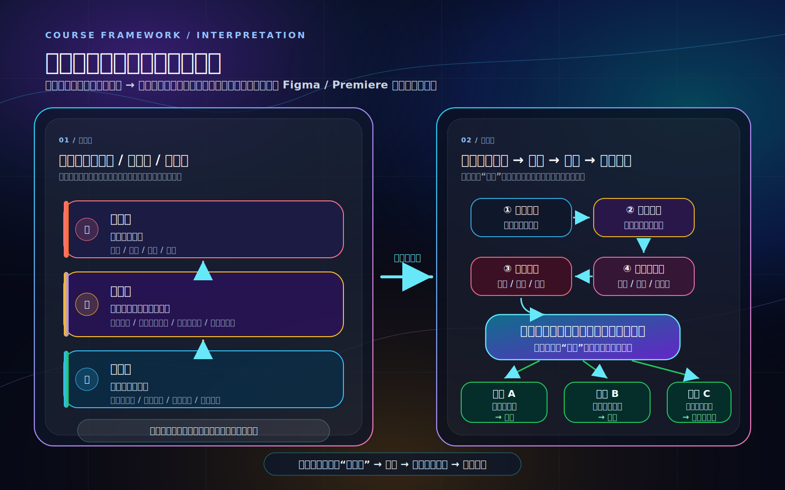

# 解读与情绪课程视觉框架

## 如果图片还是看不见

打开 [`ALWAYS_VISIBLE_PREVIEW.md`](./ALWAYS_VISIBLE_PREVIEW.md)。这是纯文字框架版，不依赖 SVG、HTML、图片渲染或外部网站；只要能看到文字，就能看到图的结构。

## iPad / 手机直接看图

如果你在 iPad 上点开 `.svg`、`.html` 或 `.md` 看到源码，直接打开 [`IPAD_PREVIEW.md`](./IPAD_PREVIEW.md)。这个文件里放的是在线渲染后的图片链接，点开就能直接看图，不需要下载或安装软件。

这组图把“很多负面情绪来自解读，而不是事实本身”的课程核心，拆成多张可直接预览的 SVG 图。新增的专业版总图采用“先方案三，再方案一”的叙事：先分层看见解读，再进入选择空间。

## 最简单的查看方式

如果你在 GitHub 上看，直接看下面“直接预览”里的专业版总图。

如果你下载了整个文件夹到本地，优先用浏览器打开 [`preview.html`](./preview.html)。`preview.html` 会把专业版总图和其他 SVG 图按顺序显示出来。

如果你只想看旧版四张图的单文件预览，也可以打开 [`OPEN_ME.html`](./OPEN_ME.html)。

## 直接预览

> 在 GitHub 的普通文件页面里，这里会显示图片；如果你点了 `Raw`，就会看到源码。

### 专业版总图：先方案三，再方案一

### 方案一：课程主框架图

### 方案二：同一句话，不同解读，不同情绪

### 方案三：事实层 / 解读层 / 情绪层

### 方案四：自动反应路径 vs 有觉察路径

## 文件说明

1. `05-professional-narrative.svg`：专业版总图，采用 Figma / Adobe Premiere 式暗色玻璃拟态与辉光风格，叙事顺序是“方案三分层 → 方案一流程”。
2. `OPEN_ME.html`：最稳妥的查看入口。四张图已经直接嵌在这个单文件 HTML 里，下载后用浏览器打开即可看到实际图。
3. `preview.html`：文件夹版查看入口，会引用同目录下的 SVG 图。
4. `01-core-flow.svg`：主框架图，呈现“事实 → 自动解读 → 情绪 → 被带走 → 看见解读 → 其他可能 → 情绪松动 → 新选择”。
5. `02-same-fact-branches.svg`：例子分叉图，呈现同一句话可以被解读为关心、嫌弃或讽刺，并引发不同情绪。
6. `03-layer-model.svg`：三层模型图，把情绪层、解读层、事实层分开，帮助学员分辨自己是在回应事实还是回应解读。
7. `04-two-paths.svg`：路径对照图，对比“看不见解读的自动反应路径”和“看见解读的有觉察路径”。

## 最推荐作为课程总图

现在优先使用 `05-professional-narrative.svg` 作为课程总图，因为它按“方案三 → 方案一”的顺序讲：先把情绪、解读、事实分层，再进入“事实 → 自动解读 → 情绪 → 暂停 → 其他可能 → 情绪松动”的行动流程。若只需要极简流程版，再使用 `01-core-flow.svg`。
