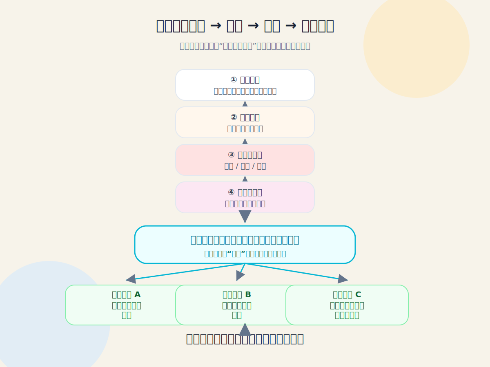
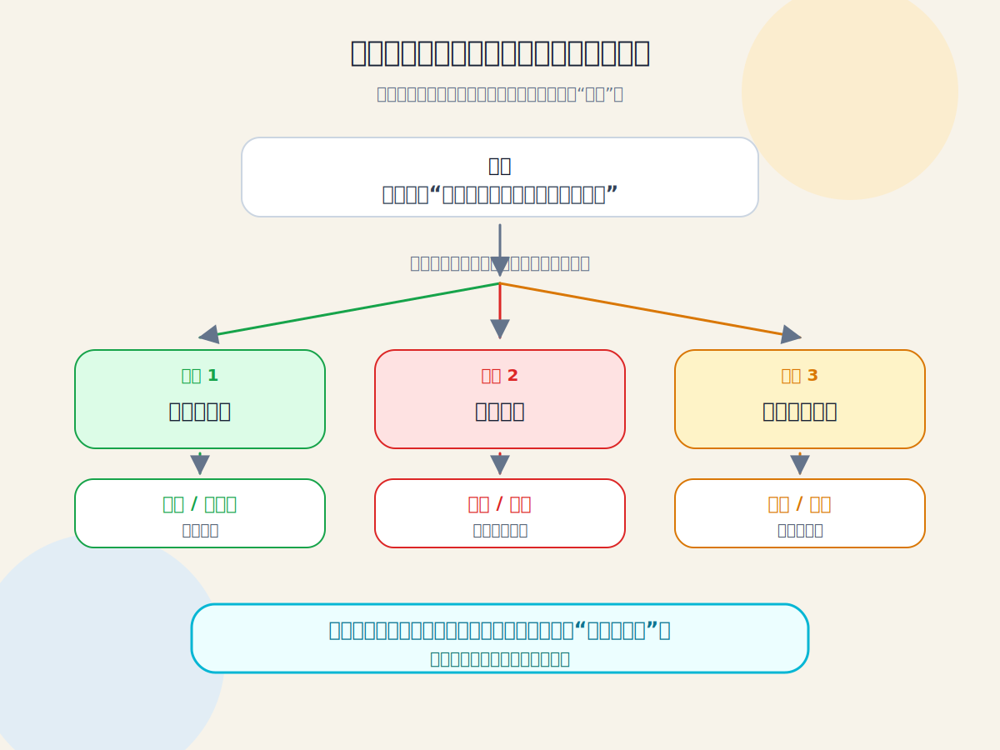
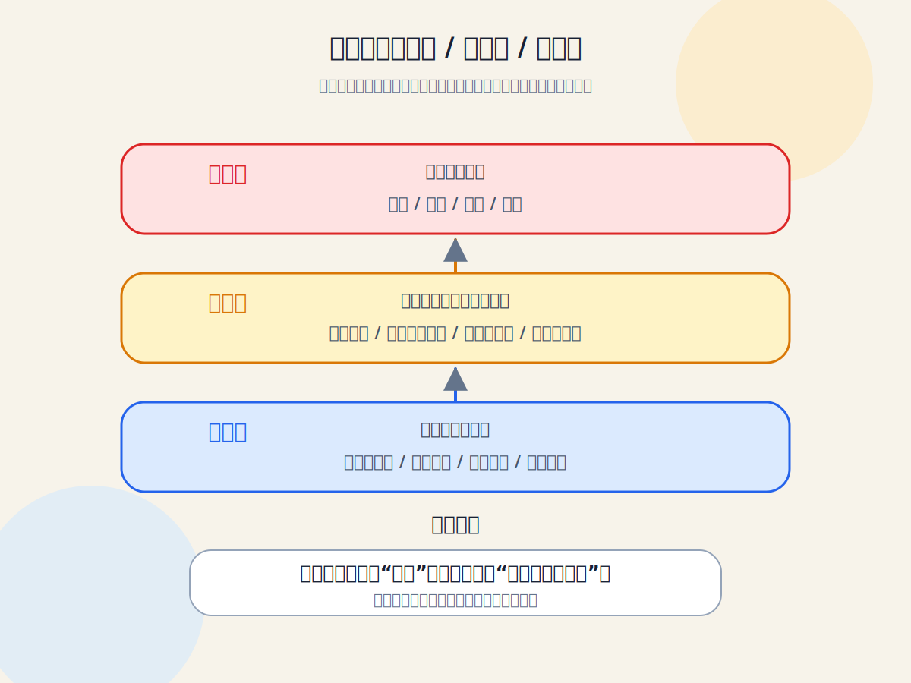
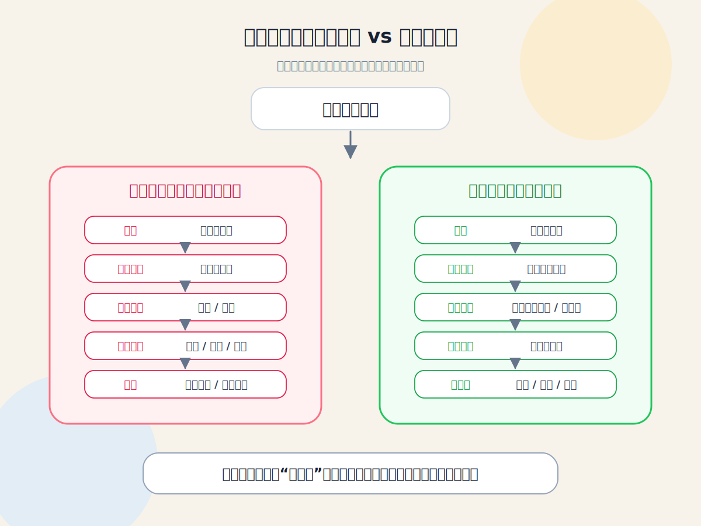

# 解读与情绪课程视觉框架

这组图把“很多负面情绪来自解读，而不是事实本身”的课程核心，拆成四张可直接预览的 SVG 图。

## 最简单的查看方式

如果你在本地打开 `.md` 文件时看到的是文字或源码，请改用下面这个文件：

> **最稳妥：双击或用浏览器打开 [`OPEN_ME.html`](./OPEN_ME.html)**
>
> 这个文件是单文件预览页，四张图已经直接嵌在里面；即使你只下载这一个文件，也能看到实际画面。

如果你下载了整个文件夹，也可以打开 [`preview.html`](./preview.html)。`preview.html` 会引用同目录下的四张 SVG 图。

## 直接预览

> 在 GitHub 的普通文件页面里，这里会显示图片；如果你点了 `Raw`，就会看到源码。

### 方案一：课程主框架图

### 方案二：同一句话，不同解读，不同情绪

### 方案三：事实层 / 解读层 / 情绪层

### 方案四：自动反应路径 vs 有觉察路径

## 文件说明

1. `OPEN_ME.html`：最稳妥的查看入口。四张图已经直接嵌在这个单文件 HTML 里，下载后用浏览器打开即可看到实际图。
2. `preview.html`：文件夹版查看入口，会引用同目录下的四张 SVG 图。
3. `01-core-flow.svg`：主框架图，呈现“事实 → 自动解读 → 情绪 → 被带走 → 看见解读 → 其他可能 → 情绪松动 → 新选择”。
4. `02-same-fact-branches.svg`：例子分叉图，呈现同一句话可以被解读为关心、嫌弃或讽刺，并引发不同情绪。
5. `03-layer-model.svg`：三层模型图，把情绪层、解读层、事实层分开，帮助学员分辨自己是在回应事实还是回应解读。
6. `04-two-paths.svg`：路径对照图，对比“看不见解读的自动反应路径”和“看见解读的有觉察路径”。

## 最推荐作为课程总图

优先使用 `01-core-flow.svg` 作为课程的核心流程框架。它最简洁地表达了课程闭环：发生一件事后，人会自动做出解读，情绪随之产生；当学员看见“这只是我的一种解读”时，就能尝试其他可能，让情绪松动，并拥有新的回应选择。
